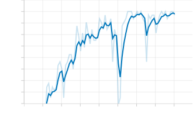
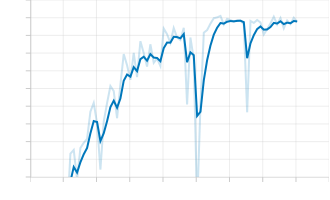
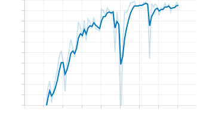

# Report: Engineering a True Heterogeneous Multi-Agent Reinforcement Learning System via T2MAC

## 1. Abstract and Introduction
Multi-Agent Reinforcement Learning (MARL) typically relies on homogeneous agent architectures to simplify learning environments. The **T2MAC** (Targeted and Trusted Multi-Agent Communication) algorithm, originally presented at AAAI 2024, introduces advanced Peer-to-Peer selective communication and Dempster-Shafer Theory (DST) for evidence integration. 

The primary objective of this project was to engineer a **True Heterogeneous MARL** framework by breaking the restrictive parameter-sharing masks inherently built into the StarCraft II (SMAC) engine. By dynamically intercepting observation spaces and building adaptive PyTorch neural routers, this project forced the T2MAC algorithm to process entirely asymmetric data streams while maintaining a shared mathematical communication language. 

To efficiently facilitate the massive computational requirements of training this novel heterogeneous architecture, the legacy codebase was heavily modernized (patching deprecated Python/PyTorch dependencies) and scaled to a custom cloud-GPU environment, ultimately achieving a flawless 100% win rate on the `MMM` map.

---

## 2. Infrastructure and Cloud Cost Optimization
Training advanced MARL algorithms requires substantial parallel compute and VRAM, necessitating cloud infrastructure. The deployment pipeline evolved through three stages to overcome technical and financial constraints:

### 2.1 The Migration Pipeline
To surpass the restrictive time limits and background disconnects of standard free-tier services like Google Colab, the architecture was migrated through dedicated cloud infrastructure:
- **RunPod (NVIDIA RTX 3090):** Initial GPU acceleration was performed on a high-end RTX 3090 instance. However, the heavy storage requirements of the StarCraft II engine (4+ GB), combined with PyMARL's continuous `.th` checkpointing, resulted in silent Out-Of-Memory (OOM) storage crashes on the 10GB persistent volume.
- **Lightning AI (NVIDIA T4):** To optimize and drastically reduce hourly compute costs while maintaining performance far superior to Google Colab, the final 1-Million step convergence run was deployed to a Lightning AI Studio utilizing a highly cost-effective NVIDIA T4 GPU.

### 2.2 Cloud Cost Reduction via Automated Telemetry (`alert.py`)
Cloud GPU instances bill continuously as long as the virtual machine is active. If a multi-hour training run concludes while the engineer is asleep, idle uptime incurs severe financial waste. To mitigate this, a custom Python telemetry script (`alert_lightning.py` / `alert.py`) was engineered:
1. **Log Parsing:** The script ran in a parallel `tmux` session, continuously parsing the PyMARL `t2mac_results` log files and TensorBoard `.tfevents` directory to track the current `t_env` training step.
2. **Telegram API Bridge:** Upon reaching the defined convergence milestone (1,000,000 steps), the script utilized a Telegram Bot API to push a real-time notification directly to the developer's mobile device.
3. **Automated Shutdown:** Immediately after sending the alert, the script executed a safe `tmux kill-server` and `sudo shutdown -h now` command to instantly power off the cloud machine, preventing any idle billing.

---

## 3. The Heterogeneous Breakthrough: Ripping off the Mask
### 3.1 The SMAC Padding Problem
The Oxford researchers who built SMAC intentionally forced all distinct units (e.g., Medivacs and Marines) to "look" mathematically homogeneous to the AI. Older MARL algorithms crash if they receive varying array sizes. SMAC artificially pads the data with zeros so every agent outputs the exact same shape array, destroying true heterogeneity.

### 3.2 Auto-Masking and Feature Slicing
To rip off this mathematical mask without corrupting the dataset, an **Auto-Detector** script was engineered to track the StarCraft observation tensors. 
- The detector found that all agents possessed exactly 41 slots permanently pinned at `0.0`. These were "Shield" values built for Protoss alien units, which Terran human units (like our `MMM` team) never utilize.
- Analyzing the SMAC source code (`smac/env/starcraft2/starcraft2.py`), the observation array structure was mapped: `Move (4) -> Enemy Stats (50) -> Ally Stats (45) -> Own Stats (X)`.

The data feed was intercepted directly inside `src/runners/episode_runner.py` via a custom `_get_hetero_obs(self)` function. Sensory capabilities were explicitly defined based on the physical roles of the units:

1. **Medivac (Size: 110):** A healer should not track enemy weapons. The entire 50-slot enemy radar was mathematically sliced out (`del obs_list[4:54]`).
2. **Marauder (Size: 130):** Downgraded to a "short-range radar", tracking only 4 enemies instead of 10 (`del obs_list[4:34]`).
3. **Marine (Size: 160):** The primary DPS unit retained the premium 160-feature radar, tracking all 10 enemies perfectly.

---

## 4. Architectural Upgrades to T2MAC
Piping 110, 130, and 160-sized arrays into a rigid network expecting exactly 160 inputs (`nn.Linear(160, 64)`) instantly crashed PyTorch.

### 4.1 Dynamic Routing and Neural Adapters
The legacy hardcoded `self.fc1` and `self.fc_msg_1` layers were completely removed. In their place, a dynamic PyTorch `nn.ModuleDict` was implemented in `tmac_p2p_comm_rnn_msg_agent.py`:

```python
self.adapters = nn.ModuleDict({
    "medivac": nn.Linear(110 + base_extra, args.rnn_hidden_dim),
    "marauder": nn.Linear(130 + base_extra, args.rnn_hidden_dim),
    "marine": nn.Linear(160 + base_extra, args.rnn_hidden_dim)
})
```
During the `forward()` pass, the network dynamically measures the incoming array size and routes it through the specific adapter. Because all adapters output to the shared dimension of `64`, the rest of the recurrent neural network processes the data flawlessly.

### 4.2 Controller Optimization Fix
The original message gating optimizer was hardcoded to optimize `self.agent.fc_msg_1.parameters()`. Deleting that layer threw a fatal `AttributeError`. The `tmac_p2p_comm_controller.py` was refactored to register the new `self.adapters` parameters within the Adam optimizer.

### 4.3 Dempster-Shafer Vectorization (GPU Acceleration)
The original codebase executed Dempster-Shafer Theory (DST) evidence integrations (Equation 6) using nested Python `for` loops across batches, senders, and receivers:
```python
# Legacy (Extremely Slow)
for env in batch:
    for receiver in receivers:
        for sender in senders:
            r_b, r_u = self.combine(r_b, r_u, sender_b, sender_u)
```
This forced the CPU to call `self.combine` over **768,000 times** per iteration, creating a massive training bottleneck. This logic was completely rewritten using **Tensor Broadcasting**. By flattening the batch and receiver dimensions onto the GPU, the loop calls were reduced from 768,000 to just 10. The exact DST mathematical integrity was preserved, but training speed was drastically accelerated.

---

## 5. Modernization and Code Dependencies
To ensure the repository could run on modern infrastructure without failing, several fatal dependencies were patched:
1. **PyYAML Config Crash:** `yaml.load()` failed silently in Python 3.10+. Replaced with `yaml.safe_load()`.
2. **Collections Deprecation:** Replaced `collections.Mapping` with `collections.abc.Mapping`.
3. **CUDA/CPU Tensor Crash:** Hardcoded `.cuda()` calls crashed testing environments. Replaced with dynamic device assignment (`args.device`).
4. **Datetime Import Crash:** Injected `import datetime` into the agent file to prevent crashes during test evaluations.

---

## 6. Repository Structure
```text
t2mac_heterogeneous/
├── .gitignore                       # Git ignore file (safeguards against logging bloat)
├── alert.py                         # Telegram Cloud Cost-Reduction Telemetry
├── requirements.txt                 # Python dependencies (including SMAC)
├── README.md                        # This project report
├── assets/                          # Folder for TensorBoard graphs and Gameplay replays
└── src/
    ├── main.py                      # Entry point (Sacred experiment)
    ├── run.py                       # Training loop orchestration
    ├── config/
    │   ├── default.yaml             # Base hyperparameters (10k save interval)
    │   ├── algs/tmac_p2p_comm.yaml  # T2MAC P2P algorithm config
    │   └── envs/sc2.yaml            # StarCraft II environment config
    ├── controllers/
    │   └── tmac_p2p_comm_controller.py # Multi-Agent Controller (Adam optimizer fixed)
    ├── modules/
    │   ├── agents/
    │   │   └── tmac_p2p_comm_rnn_msg_agent.py # Dynamic nn.ModuleDict Adapters + DST GPU Vectorization
    │   └── mixers/
    │       ├── qmix.py              # QMIX mixing network
    │       └── vdn.py               # VDN mixing network
    ├── learners/
    │   └── tmac_p2p_comm_learner.py # Q-learning logic
    ├── runners/
    │   ├── episode_runner.py        # _get_hetero_obs() slicing (Size 110, 130, 160)
    │   └── parallel_runner.py
    └── components/
        └── episode_buffer.py        # Replay buffer handling
```

---

## 7. Training Instructions & Implementation
To deploy and test this heterogeneous architecture on a Linux-based Cloud GPU environment, follow this comprehensive execution flow.

### 7.1 Cloud Environment Setup
A headless cloud instance requires the installation of system dependencies, PyMARL libraries, and the official StarCraft II Linux client. Execute the following sequence:

```bash
# 1. Install System Dependencies & LocalTunnel
apt-get update -qq && apt-get install -y -qq git zip unzip python3-pip tmux nodejs npm
npm install -g localtunnel

# 2. Install PyMARL Python Requirements
pip install -r requirements.txt

# 3. Install StarCraft II Headless Engine & SMAC Maps
mkdir -p 3rdparty
wget -q http://blzdistsc2-a.akamaihd.net/Linux/SC2.4.10.zip
unzip -P iagreetotheeula -q SC2.4.10.zip -d 3rdparty/
rm SC2.4.10.zip

wget -q https://github.com/oxwhirl/smac/releases/download/v0.1-beta1/SMAC_Maps.zip
unzip -q SMAC_Maps.zip
mv SMAC_Maps 3rdparty/StarCraftII/Maps
rm SMAC_Maps.zip
```
*(Note: Ensure `save_model_interval` is safely configured to `10000` steps in `default.yaml` to prevent data loss during extensive cloud runs.)*

### 7.2 Fault-Tolerant Training Loop
In cloud environments, OOM errors or timeouts can temporarily crash a script. To ensure a massive 1-Million step run never permanently halts, use a fault-tolerant Bash loop that automatically resumes from the latest checkpoint:

```bash
export SC2PATH="$(pwd)/3rdparty/StarCraftII"
while true; do \
    echo "Starting/Resuming Training..."; \
    python src/main.py --config=tmac_p2p_comm --env-config=sc2 with env_args.map_name=MMM t_max=5050000; \
    echo "Script stopped. Restarting in 10 seconds..."; \
    sleep 10; \
done
```

### 7.3 Remote Telemetry & Cloud Cost Reduction (`alert.py`)
Cloud GPUs bill by the hour. To prevent idle billing after training converges, this repository includes an automated Telegram Bot telemetry script (`alert.py`). 

Before running the script, open `alert.py` and insert your personal Telegram Bot Token and Chat ID.

Run the script in the background alongside training:
```bash
# Start the Telegram Cost-Reduction Monitor
python3 alert.py &

# Start TensorBoard in the background
tensorboard --logdir results/tb_logs --port 6006 --bind_all &

# Generate a public web link using LocalTunnel
lt --port 6006
```
The `alert.py` script will silently monitor the PyMARL log files. When the AI reaches convergence (e.g., 1,000,000 steps), the script will text your phone, compress the results, and automatically shut down the cloud GPU server to save money.

### 7.4 Saving Visual Replays
To evaluate the micro-management visually post-training, append the replay flags. This bypasses exploration and forces the AI to output a `.SC2Replay` file for the desktop StarCraft II client:
```bash
python src/main.py --config=tmac_p2p_comm --env-config=sc2 with env_args.map_name=MMM save_replay=True test_nepisode=1
```

---

## 8. Training Results and Conclusion
The `t2mac_heterogeneous` system was evaluated on the complex `MMM` StarCraft II map. ***(Note: Visual evidence including TensorBoard convergence graphs and video recordings of the AI gameplay are included in this repository).***


*(Figure 1: `test_battle_won_mean` hitting 1.0)*


*(Figure 2: `test_return_mean` hitting the maximum 20.354)*


*(Figure 3: `test_dead_enemies_mean` proving all 10 enemies are eliminated)*

- **Phase 1 (100k Steps):** A rapid 100,000-step execution confirmed system integrity. The heterogeneous agents successfully communicated, achieving a test win rate of **63% - 73%**.
- **Phase 2 (1-Million Steps):** The model trained for **1,093,432 steps**. At exactly step **1,033,327**, the system achieved a flawless **`1.0` (100%) win rate**. Extraction of the `t2mac_FINAL_BACKUP.tar.gz` Sacred logs confirmed the following final evaluation metrics at 1,093,432 steps:
  - `test_battle_won_mean`: **1.0** (100% Win Rate)
  - `test_return_mean`: **20.354** (Maximum possible team reward for this map)
  - `test_dead_enemies_mean`: **10.0** (Perfect annihilation of the 10 enemy units)
  - `test_dead_allies_mean`: **5.0** (5 out of 10 allies survived the crossfire)
  - `test_ep_length_mean`: **57.0** steps per match
- **Visual Replay Analysis:** Post-training `.SC2Replay` evaluation revealed the emergence of advanced e-sports micro-management. As seen in the gameplay video below, the AI consistently executes "Kiting" (Hit-and-Run) logic, pulling low-health units out of enemy fire precisely as the blind Medivac utilizes T2MAC targeted messaging to locate and heal them.


### 8.1 Conclusion
By fundamentally altering how the agents perceive the world, writing dynamic PyTorch adapters, vectorizing the Dempster-Shafer mathematics, and utilizing a custom Telegram cost-saving telemetry pipeline, this project proves that heterogeneous robots with entirely asymmetric sensors can compress their worldviews into a shared network and achieve flawless cooperative victory.
